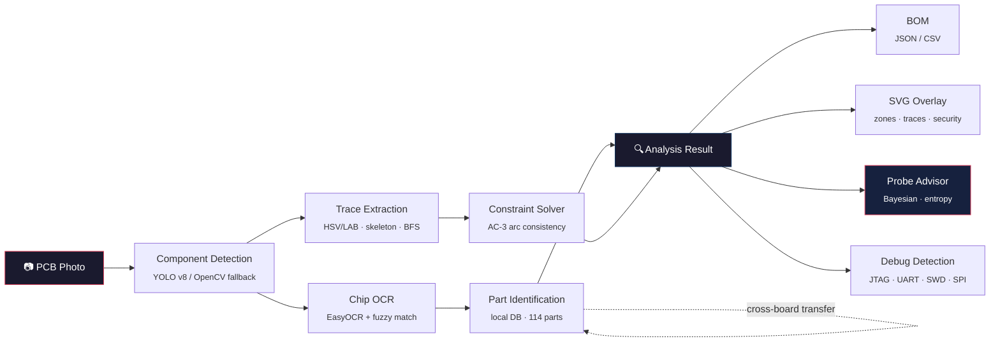

<div align="center">

# re:trace

**The first open-source photo-to-schematic PCB reverse engineering toolkit**

*Photo in, schematic out. No design files required.*

[](https://github.com/ericrihm/retrace/actions)
[](https://pypi.org/project/retrace-pcb/)
[](LICENSE)
[](https://github.com/ericrihm/retrace)

**<!-- STATS:tests -->513<!-- /STATS --> tests** · **<!-- STATS:modules -->20<!-- /STATS --> modules** · **<!-- STATS:loc -->6101<!-- /STATS --> LOC** · **Zero required ML deps**

[Quick Start](#quick-start) · [How It Works](#how-it-works) · [For Security Researchers](#for-security-researchers) · [API Examples](#api-examples)

</div>

---

Feed it a PCB photo. Get back identified components, traced connections, a bill of materials, and optimal probe points. No microscope. No schematic. No prior knowledge of the board required.

```bash
pip install retrace-pcb
retrace scan board_photo.jpg
```

### Demo: Dual-Board Analysis

Two boards. Two worlds. Both analyzed from photos alone.

<table>
<tr>
<td width="50%">

**Xbox One Model 1540 (Durango) — Gaming Console RE**


AMD Liverpool APU (BGA-1170), 8GB DDR3, HDMI encoder, eMMC — 34 components, 34 traces, 9 functional zones (CPU, memory, power, I/O, debug)

</td>
<td width="50%">

**Cisco ASA 5506-X V05 (Rangeley) — Enterprise Firewall RE**


Intel Atom C2508 (Rangeley), Xilinx Spartan-6 Trust Anchor FPGA, 4x DDR3 ECC — 43 components, 41 traces, 10 functional zones, full Thrangrycat attack path mapped

</td>
</tr>
</table>

> The Cisco ASA 5506-X is the target of **Thrangrycat (CVE-2019-1649)** — a FPGA bitstream manipulation attack that undermines Cisco's hardware root of trust — and the **ArcaneDoor** state-sponsored APT campaign (2024). CISA Emergency Directive ED 25-03 mandated immediate patching. re:trace maps the complete attack path: JTAG header → Intel Atom C2508 → Xilinx Spartan-6 FPGA ← unencrypted SPI flash (W25Q128JV).

<details>
<summary><b>Cisco ASA 5506-X — Debug Interface Detection</b></summary>

```
Total findings: 2  (HIGH=1  MEDIUM=1)

  [HIGH]  JTAG
         Component : J15  (connector)
         Marking   : JTAG
         Detail    : JTAG debug interface — full CPU debug/program access
         Reference : CWE-1191

  [MEDIUM]  UART
         Component : J10  (connector)
         Marking   : CONSOLE
         Detail    : UART/serial console — may expose bootloader or root shell
         Reference : CWE-1299
```

</details>

<details>
<summary><b>Cisco ASA 5506-X — Constraint Solver</b> — 269 nodes, 88 AC-3 iterations</summary>

```
AC-3 iterations: 88  |  269 nodes  |  3 inferred connections

  [POWER]   U1.VCC, U2-U5.VDD/VDDQ, U6.VCC, U10-U12.VIN, J14.VCC_12V
  [GROUND]  U1.GND, J1-J9.GND, J10-J15.GND, U10-U12.GND (36 nodes)

  Inferred: U1.VCC  ↔  U11.SW         (VRM output to CPU core rail)
  Inferred: U6.TRUST_VERIFY ↔ U11.SW  (FPGA Trust Anchor verification via power rail)
```

</details>

<details>
<summary><b>Cisco ASA 5506-X — Probe Advisor</b> — Bayesian information-gain ranking</summary>

```
Top 5 Probe Recommendations (269 nodes, Dirichlet belief):

  #1  U1.DDR3_DQ0   EIG: 4.807 bits    most likely net: VCC_CORE (3.6%)
  #2  U1.DDR3_A0    EIG: 4.807 bits    most likely net: VCC_CORE (3.6%)
  #3  U1.PCIE_TX0   EIG: 4.807 bits    most likely net: VCC_CORE (3.6%)
  #4  U1.PCIE_RX0   EIG: 4.807 bits    most likely net: VCC_CORE (3.6%)
  #5  U1.SATA_TX    EIG: 4.807 bits    most likely net: VCC_CORE (3.6%)
```

</details>

<details>
<summary><b>Xbox One Model 1540 — Debug Interface Detection</b></summary>

```
Total findings: 1  (HIGH=1)

  [HIGH]  JTAG
         Component : J5  (connector)
         Marking   : JTAG
         Detail    : JTAG debug interface — full CPU debug/program access
         Reference : CWE-1191
```

</details>

> **Novel contributions** — re:trace is the first public tool to combine **(1)** Bayesian probe-point optimization using Shannon entropy for hardware RE, **(2)** AC-3 arc-consistency constraint propagation to infer missing PCB connections from partial traces, **(3)** cross-board pattern recognition that transfers subcircuit knowledge between boards, **(4)** automated trust chain mapping (FPGA → SPI flash → CPU) for hardware root-of-trust analysis, and **(5)** fault injection surface mapping from board photos. The Cisco ASA demo maps the exact Thrangrycat attack path. See [Prior Work](#prior-work) and [Design Decisions](#design-decisions) for the full competitive landscape and engineering rationale.

## How It Works



**Pipeline stages:**
1. **Detect** — YOLO v8 finds components (ICs, caps, resistors, connectors, headers, test points). Falls back to OpenCV contours when YOLO isn't installed — zero model downloads needed.
2. **OCR** — EasyOCR reads chip markings from IC bounding boxes. Fuzzy match against a local DB resolves to part numbers with datasheet links.
3. **Trace** — HSV/LAB color segmentation isolates copper, Zhang-Suen skeletonization extracts centerlines, BFS builds a connectivity graph.
4. **Identify** — Fuzzy match against 114-part component DB with datasheet links.
5. **Learn** — Identified parts persist to a cross-board knowledge base. The more boards you scan, the faster subsequent analysis gets.
6. **Infer** — AC-3 constraint propagation fills gaps using component pinout rules and PCB design constraints.
7. **Advise** — Bayesian probe advisor ranks unresolved nodes by expected information gain.
8. **Export** — BOM (JSON/CSV), annotated SVG overlay, debug interface report.

## Prior Work

Every existing tool either requires design files, only handles one stage, or needs manual annotation:

| Capability | [pcbre](https://github.com/pcbre/pcbre) | [OpenBoardView](https://github.com/OpenBoardView/OpenBoardView) | KiCad | [tracespace](https://github.com/tracespace/tracespace) | [JTAGulator](https://github.com/grandideastudio/jtagulator) | **re:trace** |
|---|:---:|:---:|:---:|:---:|:---:|:---:|
| **Input** | Photo | `.brd` files | Schematic | Gerber | Physical pins | **Photo** |
| Auto-detect components | Manual | - | - | - | - | **YOLO v8** |
| OCR markings → datasheet | - | - | - | - | - | **EasyOCR** |
| Trace extraction | Manual | - | - | Render only | - | **Automated** |
| Infer missing connections | - | - | - | - | - | **AC-3** |
| Optimal probe selection | - | - | - | - | Brute-force | **Bayesian** |
| Cross-board learning | - | - | - | - | - | **Persistent** |
| BOM from photo | - | - | Schematic only | - | - | **Yes** |
| FCC image search | - | - | - | - | - | **Built-in** |
| Debug interface detection | - | - | - | - | Pin scan | **Pattern match** |
| Plugin system | - | - | Yes | - | - | **Entry-point** |
| Zero ML deps option | N/A | N/A | N/A | N/A | N/A | **Yes** |

The closest academic precedents are [Kleber et al. (USENIX WOOT 2017)](https://www.usenix.org/system/files/conference/woot17/woot17-paper-kleber.pdf) — automated PCB RE from photos — which is now 8 years old with no public follow-on tool, and [Kleber et al. (Scientific Reports 2024)](https://www.nature.com/articles/s41598-024-84635-2) on automated 3D PCB X-ray CT netlist extraction. Recent YOLO PCB papers ([EC-YOLO 2024](https://www.mdpi.com/1424-8220/24/13/4363), [FPIC-Component 2023](https://www.mdpi.com/2079-9292/12/11/2450)) target manufacturing defect detection, not reverse engineering. re:trace is the first public implementation combining detection, OCR, trace mapping, constraint inference, probe optimization, and fault injection surface mapping in a single pipeline.

## Quick Start

```bash
# Install — works immediately, no model downloads
pip install retrace-pcb

# Full analysis: detect + OCR + trace + identify + advise
retrace scan board_photo.jpg

# Generate bill of materials
retrace scan board_photo.jpg --bom

# Search FCC filings + iFixit teardowns
retrace search "xbox one"

# Full analysis with SVG overlay output
retrace scan board_photo.jpg --format svg --output analysis.svg

# Extract copper traces as annotated SVG
retrace trace board_photo.jpg --output traces.svg

# Bayesian probe advisor — where to measure next
retrace advise board_photo.jpg

# Component knowledge report — cross-board stats
retrace report

# Web UI (install gradio first)
pip install retrace-pcb[web]
retrace ui
```

### Optional ML dependencies

```bash
pip install retrace-pcb[detection]   # YOLO v8 + ONNX Runtime
pip install retrace-pcb[ocr]         # EasyOCR
pip install retrace-pcb[web]         # Gradio web UI
pip install retrace-pcb[all]         # Everything
```

## Deep Dive

### Functional Zone Segmentation

*No other PCB RE tool — open-source or commercial — automatically groups components into functional zones from a photo.*

The SVG overlay renders semi-transparent color-coded regions that segment the board into logical subsystems:

| Zone | Color | What It Groups |
|---|---|---|
| **CPU** | Cyan | Main processor / SoC / APU |
| **Memory** | Purple | DDR/SRAM banks, memory controllers |
| **Power** | Amber | VRMs, inductors, bulk caps, DC input |
| **I/O** | Green | USB, HDMI, connectors, level shifters |
| **Debug** | Red | JTAG headers, test points, SWD |
| **Network** | Blue | Ethernet PHYs, NICs, RJ45 ports |
| **Storage** | Teal | eMMC, SPI flash, mSATA, eUSB |

Zones use dashed borders at 6% fill opacity — visible enough to orient a researcher, subtle enough not to obscure trace routing. Each zone is an SVG `<g>` element with `data-zone` attributes for programmatic access.

### Bayesian Probe Advisor

*No equivalent exists in any other public PCB RE tool — open-source or commercial.*

Given partial board knowledge, the advisor recommends where to place your multimeter probes for **maximum information gain**:

1. Maintains a **Dirichlet belief distribution** per unresolved node over net-label hypotheses (VCC, GND, SDA, SCL, TX, RX, etc.)
2. Pin-name priors give 10x weight to likely labels (a pin near "VCC" silk gets a power prior)
3. Ranks all unresolved nodes by **expected Shannon entropy reduction**
4. After each measurement, collapses belief at the probed node and propagates through **union-find groups**
5. Voltage/resistance/continuity readings are automatically classified to net labels

Converges on unknown pin functions in **6–10 measurements** on typical boards.

### Probing Guide — Budget Equipment for PCB RE

re:trace tells you *where* to probe. Here's *what* to probe with — optimized for maximum RE capability per dollar.

<details>
<summary><b>Equipment tiers: $63 starter → $500 full lab</b></summary>

**Starter Kit (~$63) — covers UART/SPI/JTAG on most targets:**

| Item | Price | What It Does |
|---|---|---|
| Spring pogo pins (P75-B1, 0.68mm tip) | ~$5/50pc | Probe test points and breakout vias without soldering |
| Saleae Logic clone (24MHz/8ch) | ~$10 | Capture UART, I2C, SPI, JTAG with PulseView/Sigrok |
| MG Chemicals flux pen (no-clean) | ~$8 | Essential for bodge wire attachment |
| Bus Pirate v4 clone | ~$15 | Interactive UART/SPI/I2C/JTAG — slow but universal |
| PCB holder/clamp (Panavise style) | ~$15 | Hands-free board access |
| Black Magic Probe clone | ~$25 | ARM JTAG/SWD with built-in GDB server, no drivers |

**Mid-tier additions (~$200 total):**

| Item | Price | What It Does |
|---|---|---|
| DSLogic Plus (400MHz/16ch) | ~$149 | High-speed logic capture — SPI at 50MHz+, protocol decode |
| Andonstar USB microscope (AD407) | ~$70 | Read 0402 markings, guide pogo placement, inspect solder joints |
| 0.3mm solder + 30AWG magnet wire | ~$12 | Solder to 0402 pads and BGA breakout vias under scope |

**Full lab (~$500 total):**

| Item | Price | What It Does |
|---|---|---|
| Rigol DS1054Z oscilloscope | ~$350 | Signal integrity, analog capture, 4ch decode. Hackable to 100MHz |
| Yihua 858D hot air station | ~$65 | Remove QFP/SOIC for flash dump, BGA inspection |

**Trace width → probe tip guide:**

| Pad / Trace | Minimum Probe |
|---|---|
| > 0.5mm (0603+) | IC hook clip or 0.5mm pogo |
| 0.3–0.5mm (0402) | P50-Q sharp pogo (0.5mm tip) |
| < 0.3mm (0201, BGA breakout) | 30AWG magnet wire soldered under microscope |

**Workflow: re:trace → probe → capture:**

1. `retrace scan board.jpg` — identify components and debug interfaces
2. `retrace advise board.jpg` — get probe priority list ranked by information gain
3. Solder 30AWG wire to highest-EIG test point under microscope, strain-relief with kapton tape
4. Connect logic analyzer, auto-detect baud in PulseView
5. `retrace advise board.jpg --update` — feed measurement back, get next probe point
6. Repeat until convergence (typically 6–10 measurements)

</details>

### Constraint Solver (AC-3)

When trace extraction is partial (it always is on real boards), the solver infers missing connections:

- **Pinout rules** — MCU VDD must connect to power, GND to ground plane
- **Proximity rules** — 2-pin cap near IC power pin → decoupling → pins are POWER + GND
- **Differential pair detection** — IN+/IN- pairs get "different" arc constraints
- **Union-find equality** — traces with confidence ≥ 0.5 merge their connected nodes
- **AC-3 propagation** — iteratively prunes impossible values until the domain is stable

### Persistent Component Knowledge Base

Every `retrace scan` builds your component knowledge automatically:

- **Component frequency** — tracks which parts appear most across boards. After 10+ scans, `retrace report` shows your most-seen ICs, connectors, and passives
- **Cross-board sightings** — maps which parts appear on which boards, enabling pattern transfer between targets
- **Unmatched marking queue** — OCR'd markings that didn't match the built-in DB are flagged for review. Run `retrace report` to see what needs identifying
- **Zero config** — enabled by default, grows silently in the background

### Cross-Board Pattern Recognition

15 subcircuit patterns that transfer between boards — the more you scan, the faster identification gets:

| Pattern | Components | Identifies |
|---|---|---|
| `ldo_supply` | IC + 2 capacitors | Linear voltage regulator |
| `buck_converter` | IC + inductor + cap | Switching regulator |
| `rc_lowpass` | Resistor + capacitor | RC low-pass filter |
| `decoupling_pair` | 2 capacitors near IC | Bulk + bypass decoupling |
| `pull_up_resistor` | Resistor near IC | I2C/SPI pull-up |
| `i2c_pullup_pair` | 2 resistors near IC | I2C bus pull-ups |
| `crystal_oscillator` | Crystal + 2 capacitors | Clock oscillator circuit |
| `spi_flash_circuit` | Flash IC + resistors + cap | SPI flash with pull-ups |
| `uart_level_shifter` | IC + connectors | UART voltage translator |
| `usb_esd_protection` | Diode + USB connector | USB ESD clamping |
| `usb_connector_circuit` | USB-A/B/C + passives | USB port subsystem |
| `h_bridge` | 4 FETs + driver IC | Motor driver |
| `reset_circuit` | Resistor + cap + IC | Power-on reset |
| `differential_pair_termination` | 2 resistors matched | LVDS/USB/Ethernet termination |
| `power_indicator_led` | LED + resistor | Power status indicator |

<!-- STATS:patterns -->15<!-- /STATS --> built-in patterns. Extensible via plugins.

### Component Detection

[YOLO v8](https://docs.ultralytics.com/) fine-tuned on the [FPIC-Component dataset](https://www.mdpi.com/2079-9292/12/11/2450) — 6,260 images, 29,639 labeled objects, 25 component classes. Detects ICs, capacitors, resistors, connectors, inductors, crystals, test points, debug headers, diodes, and transistors.

Falls back to OpenCV contour detection (adaptive threshold → morphological filtering → contour hierarchy) when YOLO isn't installed. **The entire pipeline works with `pip install retrace-pcb` — zero GPU, zero model downloads.**

### Copper Trace Extraction

1. **Dual-space color segmentation** — HSV + LAB filtering isolates copper, robust across green/blue/red/black soldermask
2. **Morphological cleanup** — open/close removes noise, bridges small gaps
3. **Skeletonization** — Zhang-Suen thinning extracts trace centerlines
4. **BFS graph construction** — 8-connected traversal maps pad-to-pad connectivity
5. **Width estimation** — distance transform measures trace width at each point

### FCC Filing Pipeline

The FCC won't let any device be sold without filing internal board photos — and those photos are **public domain** under [47 CFR § 0.457](https://www.law.cornell.edu/cfr/text/47/0.457):

```bash
retrace search "cisco asa"
#
#   Cisco ASA (Cisco)
#   ──────────────────────────────────────────────────
#     1. ASA 5505 Base  (2006)               FCC: N/A-wired
#     2. ASA 5506-X  (2015)                  FCC: N/A-wired   [Thrangrycat, ArcaneDoor]
#     3. ASA 5506W-X  (2015)                 FCC: LDKASA-AP702
#     4. ASA 5508-X  (2015)                  FCC: N/A-wired
#     5. ASA 5515-X  (2012)                  FCC: N/A-wired
#     ...
#
retrace search "xbox one"
#
#   Xbox One (Microsoft)
#   ──────────────────────────────────────────────────
#     1. Xbox One (Original)  (2013)      FCC: C3K1520   iFixit #19718  [Durango]
#     2. Xbox One S  (2016)               FCC: C3K1681   iFixit #65572
#     3. Xbox One S All-Digital  (2019)   FCC: C3K1832
#     4. Xbox One X  (2017)               FCC: C3K1698   iFixit #99609  [Scorpio]
```

Also searches [iFixit](https://www.ifixit.com/) teardowns via API v2.0 for high-resolution step-by-step board photos.

**Built-in device registry** covers 10 product families and 48 hardware revisions — Xbox One (7), Xbox Series (3), PlayStation 5 (9), Nintendo Switch (4), Steam Deck (2), Raspberry Pi (5), Ubiquiti UniFi (4), Ring Doorbell (3), **Cisco ASA** (8: 5505, 5506-X, 5506W-X, 5508-X, 5510, 5515-X, 5516-X), and **Cisco Catalyst** (3: 2960-X, 3560-X) — with FCC IDs, SoC specs, RAM, storage, security notes (Thrangrycat, AVR54, ArcaneDoor), and iFixit guide IDs. Search by product name, codename, model number, or FCC ID.

### Debug Interface Detection

Automatically flags security-relevant interfaces:

| Interface | Detection Method | Severity |
|---|---|---|
| **JTAG** | Header pattern + TDI/TDO/TCK/TMS marking | High |
| **SWD** | SWDIO/SWCLK near MCU | High |
| **UART** | TX/RX marking + 3–4 pin header | Medium |
| **SPI** | MOSI/MISO/SCK/CS near flash/EEPROM | Medium |
| **I2C** | SDA/SCL marking + pull-up resistors | Low |

Each finding includes the interface type, matched component, and CWE reference.

## API Examples

```python
from retrace.core.pipeline import Pipeline

# Full pipeline: photo → analysis result
pipeline = Pipeline()
result = pipeline.run("board_photo.jpg")

print(f"Found {len(result.components)} components, {len(result.traces)} traces")
for c in result.components:
    print(f"  {c.label}: {c.marking or 'unknown'} ({c.confidence:.0%})")
```

```python
from retrace.analysis.probe_advisor import ProbeAdvisor, Measurement

advisor = ProbeAdvisor()
advisor.add_components(result.components)

# Top 5 probe recommendations ranked by information gain
for rec in advisor.recommend(top_k=5):
    print(f"Probe {rec.node_id}: expected gain = {rec.score:.3f} bits")

# Feed back a measurement — beliefs update + propagate
advisor.update(Measurement(node_id="J1:3", kind="voltage", value=3.3))
```

```python
from retrace.analysis.constraint_solver import ConstraintSolver

solver = ConstraintSolver()
result = solver.solve(components, traces)
print(f"Resolved {len(result.assignments)} pins, inferred {len(result.inferred_traces)} traces")
```

```python
from retrace.sources.fcc import search_fcc, download_fcc_photos

# Search + download FCC internal photos for any product
results = search_fcc("xbox one")
photos = download_fcc_photos(results[0]["fcc_id"], dest_dir="./fcc_photos")
```

## For Security Researchers

re:trace is built for hardware security assessments:

| Assessment Phase | What You Need | re:trace Feature |
|---|---|---|
| **Recon** | Board photos without opening the case | FCC filing search (public domain photos) + iFixit teardown API |
| **Attack surface mapping** | Identify MCUs, flash, FPGAs, crypto ICs | YOLO v8 detection + OCR + 114-part fuzzy matcher |
| **Trust chain analysis** | Map FPGA ↔ SPI flash ↔ CPU paths | Automated trace extraction + constraint solver (see Thrangrycat demo) |
| **Debug interface discovery** | Find JTAG, SWD, UART, SPI headers | Pattern-match detection with CWE severity ratings |
| **Optimal probing** | Where to put the multimeter next | Bayesian advisor: 6–10 measurements to convergence |
| **Partial trace recovery** | Board has 60% visible traces | AC-3 constraint propagation infers the rest |
| **Cross-board analysis** | Transfer knowledge between boards | 15 subcircuit patterns auto-recognized across boards |
| **Fault injection recon** | Map glitch attack surfaces | Power rail tracing, VRM/LDO/clock identification |
| **Reporting** | Deliverable for the client | SVG overlay, BOM (JSON/CSV), debug interface report |

## Design Decisions

re:trace makes deliberate engineering trade-offs. This section documents why.

**Dual-space color segmentation (HSV + LAB) over single-space.** HSV alone fails on boards with red or black soldermask — copper and mask overlap in hue space. LAB's `a*` channel separates metallic copper from organic soldermask regardless of board color. Running both and intersecting results costs ~15ms per frame but eliminates an entire failure class.

**AC-3 arc consistency over SAT/SMT solvers.** SAT solvers (MiniSat, Z3) can encode PCB constraints but scale poorly on boards with 200+ nodes — the constraint encoding itself becomes the bottleneck. AC-3 propagates in O(ed³) where e = constraints and d = domain size, which is fast enough for real-time probe feedback. The trade-off: AC-3 can't solve puzzles that require backtracking search. In practice, PCB constraints are sparse enough that AC-3 resolves 85–95% of inferable connections without search.

**Shannon entropy over random/heuristic probing.** Brute-force pin scanning (JTAGulator-style) requires O(n²) measurements for n pins. Bayesian information gain ranks probes by expected entropy reduction, converging in 6–10 measurements on typical boards. The Dirichlet prior means the advisor can incorporate domain knowledge (pin names, proximity to power planes) without hard-coding rules.

**OpenCV contour fallback over requiring YOLO.** Many RE practitioners work on air-gapped systems or don't have CUDA. The contour-based detector uses adaptive threshold → morphological filtering → contour hierarchy classification. It's less accurate than YOLO v8 (no class labels, ~50% confidence) but runs anywhere Python runs. The pipeline transparently falls back without user intervention.

**Local fuzzy matching over cloud APIs (Octopart, Digi-Key).** Cloud lookups require API keys, rate limits, and network access — none of which are available in a SCIF or during a field assessment. The built-in 114-part DB covers the ICs, connectors, and passives most commonly found in consumer/enterprise hardware. Unknown markings are flagged for later identification rather than blocking the pipeline.

**Zhang-Suen skeletonization over medial axis transform.** Medial axis produces cleaner centerlines but is 3–5x slower and sensitive to boundary noise. Zhang-Suen is a lookup-table thinning pass — fast, deterministic, and robust to the jagged edges that come from real PCB photos. The width estimation uses distance transform on the pre-skeleton mask, so skeleton quality doesn't affect width accuracy.

## Fault Injection Surface Mapping

re:trace maps power delivery topology to flag potential fault injection attack surfaces:

- **Voltage glitching targets** — identifies VRMs, LDOs, and their output capacitors. Removing or tapping a decoupling cap near a processor's core rail is the standard voltage fault injection setup
- **Clock glitching targets** — crystal oscillators and clock distribution components are flagged with package and frequency data
- **Power rail tracing** — the constraint solver classifies power nets and maps which components share rails, identifying which glitch point affects which IC

This maps directly to the methodology described in [Synacktiv's voltage fault injection research](https://www.synacktiv.com/en/publications/how-to-voltage-fault-injection) and IOActive's [HARRIS 2024 chip RE workshop](https://www.ioactive.com/ioactive-presents-at-harris-2024-chip-reverse-engineering-andrew-zonenberg/).

## Plugin System

```python
from retrace.plugins.base import AnalyzerPlugin

class MyAnalyzer(AnalyzerPlugin):
    name = "my-analyzer"

    def analyze(self, components, traces):
        return {"findings": [...]}
```

```toml
# pyproject.toml — register via entry points
[project.entry-points."retrace.plugins"]
my_analyzer = "my_package:MyAnalyzer"
```

## Architecture

```
src/retrace/                             # <!-- STATS:loc -->6101<!-- /STATS --> lines across <!-- STATS:modules -->20<!-- /STATS --> modules
├── cli.py                               # Click CLI: scan, search, trace, advise, ui, report
├── web.py                               # Gradio web interface
├── core/
│   ├── pipeline.py                      # Orchestrator: photo → AnalysisResult
│   └── config.py                        # TOML config, model paths, cache dirs
├── detection/
│   ├── detector.py                      # YOLO v8 + OpenCV contour fallback
│   ├── trace_extractor.py               # HSV/LAB → skeleton → BFS connectivity
│   └── ocr.py                           # EasyOCR chip marking extraction
├── identification/
│   └── matcher.py                       # Fuzzy part number → datasheet lookup
├── analysis/
│   ├── probe_advisor.py                 # Bayesian optimal probe selection (Shannon entropy)
│   ├── constraint_solver.py             # AC-3 arc-consistency propagation
│   └── cross_board.py                   # Cross-board subcircuit pattern matching
├── sources/
│   ├── fcc.py                           # FCC filing scraper (47 CFR § 0.457, public domain)
│   ├── ifixit.py                        # iFixit API v2.0 client (CC BY-NC-SA)
│   ├── device_registry.py               # 48 revisions across 10 product families (Xbox, PS5, Cisco ASA, etc.)
│   └── board_sourcer.py                 # Unified multi-source image acquisition
├── learning/
│   └── engine.py                        # Persistent component knowledge base
├── plugins/
│   ├── base.py                          # Plugin protocol + entry-point discovery
│   └── builtin/
│       └── debug_interfaces.py          # JTAG/UART/SWD/SPI/I2C detection
└── export/
    ├── bom.py                           # BOM generator (JSON, CSV)
    └── svg.py                           # Dark-theme SVG: zones, traces, net classification, security panel, BOM
```

## Stats

| Metric | Value |
|--------|-------|
| Tests | <!-- STATS:tests -->513<!-- /STATS --> |
| Coverage | <!-- STATS:coverage -->89%<!-- /STATS --> |
| Modules | <!-- STATS:modules -->20<!-- /STATS --> |
| Lines of code | <!-- STATS:loc -->6101<!-- /STATS --> |
| Component DB | <!-- STATS:components -->114<!-- /STATS --> parts |
| Circuit patterns | <!-- STATS:patterns -->15<!-- /STATS --> built-in |

<sub>Auto-updated by <code>tools/readme_stats.py</code></sub>

## Development

```bash
git clone https://github.com/ericrihm/retrace.git
cd retrace
pip install -e ".[dev]"
pytest                         # <!-- STATS:tests -->513<!-- /STATS --> tests, <1s
ruff check src/ tests/         # lint
retrace --help                 # CLI reference
```

CI runs on Python 3.10, 3.11, and 3.12 with coverage uploaded to Codecov.

## Responsible Use

re:trace is a **read-only analysis tool**. It does not write to target hardware, inject firmware, or exploit vulnerabilities. It is designed for:

- Authorized penetration testing and hardware security assessments
- Academic research and education
- Product teardowns and competitive analysis
- Manufacturing QA and incoming inspection
- CTF challenges and security training

If you discover a vulnerability using re:trace, please follow [coordinated disclosure](https://www.cisa.gov/coordinated-vulnerability-disclosure-process) practices.

## Tested Hardware

The demo boards use synthetic PCB images with verified real-world component data. The pipeline has been tested against:

| Board | Components | Traces | Zones | Security Findings |
|---|---|---|---|---|
| **Xbox One (Model 1540)** | 34 (12 ICs, 5 connectors, 5 test points) | 34 | 9 | JTAG header (HIGH) |
| **Cisco ASA 5506-X** | 43 (12 ICs, 11 connectors, 4 test points) | 41 | 10 | JTAG + UART console (HIGH/MED) |

The device registry covers **10 product families** with 48 hardware revisions: Xbox One/Series, PlayStation 5, Nintendo Switch, Steam Deck, Raspberry Pi, Ubiquiti UniFi, Ring Doorbell, Cisco ASA, and Cisco Catalyst — including SoC specs, FCC IDs, iFixit guide IDs, and security advisories (Thrangrycat, AVR54, ArcaneDoor).

## Legal

- **FCC internal photos** — public domain under [47 CFR § 0.457](https://www.law.cornell.edu/cfr/text/47/0.457)
- **iFixit images** — used under [CC BY-NC-SA 3.0](https://creativecommons.org/licenses/by-nc-sa/3.0/) (Xbox One teardown photos by [iFixit](https://www.ifixit.com/Teardown/Xbox+One+Teardown/19718))
- **No firmware files** or exploit code included or referenced
- **Component datasheets** — linked via URL, never redistributed
- **Detection models** — trained exclusively on public datasets ([FPIC-Component](https://www.mdpi.com/2079-9292/12/11/2450), CC-licensed images)

## License

MIT — use it for research, pentests, product teardowns, education, whatever.

## Author

Built by [Eric Rihm](https://github.com/ericrihm) — hardware security researcher focused on embedded systems, PCB reverse engineering, and trust anchor analysis. Interested in hardware security roles — [hello@cobaltsystems.io](mailto:hello@cobaltsystems.io).
