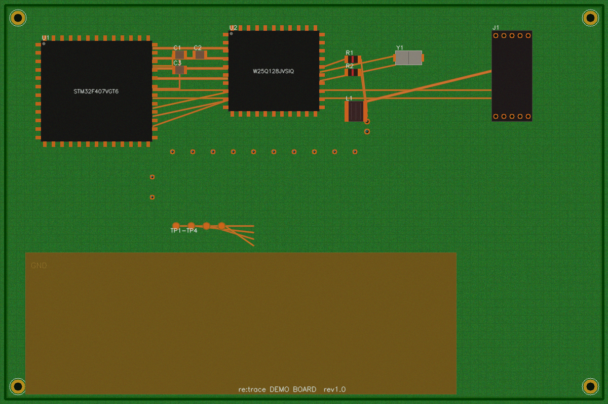
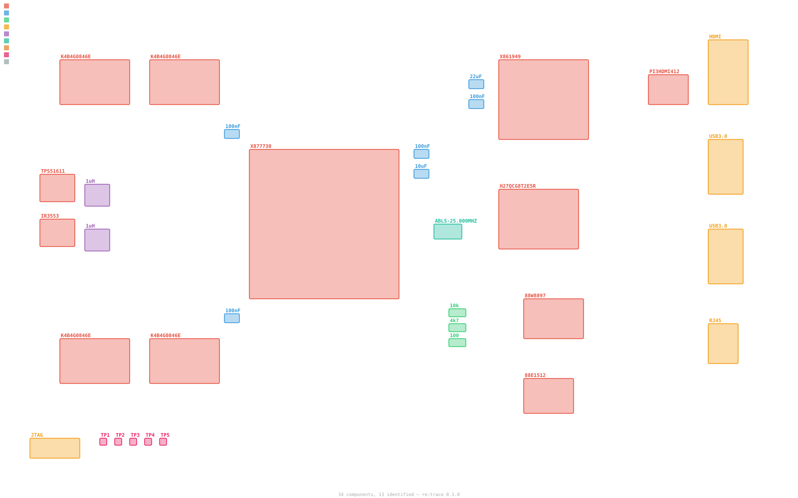
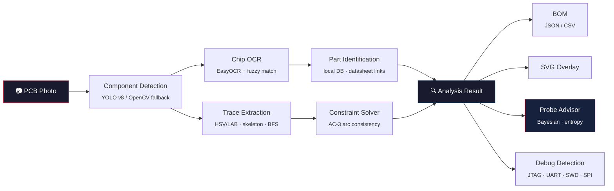

<div align="center">

# re:trace

**The first open-source photo-to-schematic PCB reverse engineering toolkit**

*The FCC won't let me be, so let me see what's on this PCB.*

[](https://github.com/ericrihm/retrace/actions)
[](https://codecov.io/gh/ericrihm/retrace)
[](https://pypi.org/project/retrace-pcb/)
[](LICENSE)

**<!-- STATS:tests -->273<!-- /STATS --> tests** · **<!-- STATS:modules -->19<!-- /STATS --> modules** · **<!-- STATS:loc -->4806<!-- /STATS --> LOC** · **Zero required ML deps**

[Quick Start](#quick-start) · [How It Works](#how-it-works) · [For Security Researchers](#for-security-researchers) · [API Examples](#api-examples)

</div>

---

Feed it a PCB photo. Get back identified components, traced connections, a bill of materials, and optimal probe points. No microscope. No schematic. No prior knowledge of the board required.

```bash
pip install retrace-pcb
retrace scan board_photo.jpg
```

### Demo: Synthetic Board Analysis

<table>
<tr>
<td width="50%">

**Input: PCB photo**



</td>
<td width="50%">

**Output: Annotated SVG overlay**



</td>
</tr>
</table>

<details>
<summary><b>Probe Advisor Output</b> — where to measure next for maximum information gain</summary>

```
re:trace Bayesian Probe Advisor — Top 5 Probe Recommendations
=================================================================

  #1  U1.PA0       EIG: 3.170 bits    most likely net: VCC (11.1%)
  #2  U1.PA1       EIG: 3.170 bits    most likely net: VCC (11.1%)
  #3  U1.PB0       EIG: 3.170 bits    most likely net: VCC (11.1%)
  #4  U1.PB1       EIG: 3.170 bits    most likely net: VCC (11.1%)
  #5  U1.SWDIO     EIG: 3.170 bits    most likely net: VCC (11.1%)

Methodology: Dirichlet belief over net labels, ranked by
expected Shannon entropy reduction (mutual information).
```

</details>

<details>
<summary><b>Constraint Solver Output</b> — inferred power network from partial traces</summary>

```
AC-3 iterations: 20  |  48 nodes  |  3 inferred connections

  [POWER]   U1.VCC, U2.VCC, C1.1, J1.VCC, L1.1
  [GROUND]  U1.GND, U2.GND, C1.2, J1.GND, Y1.GND

  Inferred: C1.1 ↔ U1.VCC  (decoupling cap)
  Inferred: C1.2 ↔ U1.GND  (decoupling cap)
  Inferred: L1.1 ↔ J1.VCC  (power inductor)
```

</details>

<details>
<summary><b>Debug Interface Detection</b> — automatic security assessment</summary>

```
Total findings: 2  (HIGH=2)

  [HIGH]  JTAG on J1 (connector, marking: SWD/JTAG)
          Full CPU debug/program access — CWE-1191

  [HIGH]  SWD on J1 (connector, marking: SWD/JTAG)
          ARM CoreSight access, firmware extraction risk — CWE-1191
```

</details>

> **Novel contributions** — re:trace is the first public tool to combine **(1)** Bayesian probe-point optimization using Shannon entropy for hardware RE, **(2)** AC-3 arc-consistency constraint propagation to infer missing PCB connections from partial traces, and **(3)** cross-board pattern recognition that transfers subcircuit knowledge between boards. No other open-source or academic PCB RE tool implements any of these three capabilities. See [Prior Work](#prior-work) for the full competitive landscape.

## How It Works



**Pipeline stages:**
1. **Detect** — YOLO v8 finds components (ICs, caps, resistors, connectors, headers, test points). Falls back to OpenCV contours when YOLO isn't installed — zero model downloads needed.
2. **OCR** — EasyOCR reads chip markings from IC bounding boxes. Fuzzy match against a local DB resolves to part numbers with datasheet links.
3. **Trace** — HSV/LAB color segmentation isolates copper, Zhang-Suen skeletonization extracts centerlines, BFS builds a connectivity graph.
4. **Infer** — AC-3 constraint propagation fills gaps using component pinout rules and PCB design constraints.
5. **Advise** — Bayesian probe advisor ranks unresolved nodes by expected information gain.
6. **Export** — BOM (JSON/CSV), annotated SVG overlay, debug interface report.

## Prior Work

Every existing tool either requires design files, only handles one stage, or needs manual annotation:

| Capability | [pcbre](https://github.com/pcbre/pcbre) | [OpenBoardView](https://github.com/OpenBoardView/OpenBoardView) | KiCad | [tracespace](https://github.com/tracespace/tracespace) | [JTAGulator](https://github.com/grandideastudio/jtagulator) | **re:trace** |
|---|:---:|:---:|:---:|:---:|:---:|:---:|
| **Input** | Photo | `.brd` files | Schematic | Gerber | Physical pins | **Photo** |
| Auto-detect components | Manual | - | - | - | - | **YOLO v8** |
| OCR markings → datasheet | - | - | - | - | - | **EasyOCR** |
| Trace extraction | Manual | - | - | Render only | - | **Automated** |
| Infer missing connections | - | - | - | - | - | **AC-3** |
| Optimal probe selection | - | - | - | - | Brute-force | **Bayesian** |
| Cross-board learning | - | - | - | - | - | **Flywheel** |
| BOM from photo | - | - | Schematic only | - | - | **Yes** |
| FCC image search | - | - | - | - | - | **Built-in** |
| Debug interface detection | - | - | - | - | Pin scan | **Pattern match** |
| Plugin system | - | - | Yes | - | - | **Entry-point** |
| Zero ML deps option | N/A | N/A | N/A | N/A | N/A | **Yes** |

The closest academic precedent is [Kleber et al. (USENIX WOOT 2017)](https://www.usenix.org/system/files/conference/woot17/woot17-paper-kleber.pdf) — automated PCB RE from photos — which is now 8 years old with no public follow-on tool. Recent YOLO PCB papers ([EC-YOLO 2024](https://www.mdpi.com/1424-8220/24/13/4363), [FPIC-Component 2023](https://www.mdpi.com/2079-9292/12/11/2450)) target manufacturing defect detection, not reverse engineering. re:trace is the first public implementation combining detection, OCR, trace mapping, constraint inference, and probe optimization in a single pipeline.

## Quick Start

```bash
# Install — works immediately, no model downloads
pip install retrace-pcb

# Full analysis: detect + OCR + trace + identify + advise
retrace scan board_photo.jpg

# Generate bill of materials
retrace scan board_photo.jpg --bom

# Search FCC filings + iFixit teardowns
retrace search "ubiquiti unifi ap"

# Extract copper traces as annotated SVG
retrace trace board_photo.jpg --output traces.svg

# Bayesian probe advisor — where to measure next
retrace advise board_photo.jpg

# Web UI (install gradio first)
pip install retrace-pcb[web]
retrace ui
```

### Optional ML dependencies

```bash
pip install retrace-pcb[detection]   # YOLO v8 + ONNX Runtime
pip install retrace-pcb[ocr]         # EasyOCR
pip install retrace-pcb[web]         # Gradio web UI
pip install retrace-pcb[all]         # Everything
```

## Deep Dive

### Bayesian Probe Advisor

*No equivalent exists in any other public PCB RE tool — open-source or commercial.*

Given partial board knowledge, the advisor recommends where to place your multimeter probes for **maximum information gain**:

1. Maintains a **Dirichlet belief distribution** per unresolved node over net-label hypotheses (VCC, GND, SDA, SCL, TX, RX, etc.)
2. Pin-name priors give 10x weight to likely labels (a pin near "VCC" silk gets a power prior)
3. Ranks all unresolved nodes by **expected Shannon entropy reduction**
4. After each measurement, collapses belief at the probed node and propagates through **union-find groups**
5. Voltage/resistance/continuity readings are automatically classified to net labels

Converges on unknown pin functions in **6–10 measurements** on typical boards.

### Constraint Solver (AC-3)

When trace extraction is partial (it always is on real boards), the solver infers missing connections:

- **Pinout rules** — STM32 VDD must connect to power, GND to ground plane
- **Proximity rules** — 2-pin cap near IC power pin → decoupling → pins are POWER + GND
- **Differential pair detection** — IN+/IN- pairs get "different" arc constraints
- **Union-find equality** — traces with confidence ≥ 0.5 merge their connected nodes
- **AC-3 propagation** — iteratively prunes impossible values until the domain is stable

### Cross-Board Pattern Recognition

The knowledge flywheel — each board analyzed teaches subcircuit patterns that transfer to future boards:

| Pattern | Components | Identifies |
|---|---|---|
| `ldo_supply` | IC + 2 capacitors | Linear voltage regulator |
| `rc_lowpass` | Resistor + capacitor | RC low-pass filter |
| `decoupling_pair` | 2 capacitors near IC | Bulk + bypass decoupling |
| `pull_up_resistor` | Resistor near IC | I2C/SPI pull-up |
| `crystal_oscillator` | Crystal + 2 capacitors | Clock oscillator circuit |

<!-- STATS:patterns -->15<!-- /STATS --> built-in patterns. Extensible via plugins.

### Component Detection

[YOLO v8](https://docs.ultralytics.com/) fine-tuned on the [FPIC-Component dataset](https://www.mdpi.com/2079-9292/12/11/2450) — 6,260 images, 29,639 labeled objects, 25 component classes. Detects ICs, capacitors, resistors, connectors, inductors, crystals, test points, debug headers, diodes, and transistors.

Falls back to OpenCV contour detection (adaptive threshold → morphological filtering → contour hierarchy) when YOLO isn't installed. **The entire pipeline works with `pip install retrace-pcb` — zero GPU, zero model downloads.**

### Copper Trace Extraction

1. **Dual-space color segmentation** — HSV + LAB filtering isolates copper, robust across green/blue/red/black soldermask
2. **Morphological cleanup** — open/close removes noise, bridges small gaps
3. **Skeletonization** — Zhang-Suen thinning extracts trace centerlines
4. **BFS graph construction** — 8-connected traversal maps pad-to-pad connectivity
5. **Width estimation** — distance transform measures trace width at each point

### FCC Filing Pipeline

Every device sold in the US has an FCC filing with **internal board photos** (public domain under [47 CFR § 0.457](https://www.law.cornell.edu/cfr/text/47/0.457)):

```bash
retrace search "nintendo switch"
#   FCC: BKEHAC001 — Game Console
#   iFixit #113044: Nintendo Switch Teardown
#   Found 10 results
```

Also searches [iFixit](https://www.ifixit.com/) teardowns via API v2.0 for high-resolution step-by-step board photos.

### Debug Interface Detection

Automatically flags security-relevant interfaces:

| Interface | Detection Method | Severity |
|---|---|---|
| **JTAG** | Header pattern + TDI/TDO/TCK/TMS marking | High |
| **SWD** | SWDIO/SWCLK near MCU | High |
| **UART** | TX/RX marking + 3–4 pin header | Medium |
| **SPI** | MOSI/MISO/SCK/CS near flash/EEPROM | Medium |
| **I2C** | SDA/SCL marking + pull-up resistors | Low |

Each finding includes the interface type, matched component, and CWE reference.

## API Examples

```python
from retrace.core.pipeline import Pipeline

# Full pipeline: photo → analysis result
pipeline = Pipeline()
result = pipeline.run("board_photo.jpg")

print(f"Found {len(result.components)} components, {len(result.traces)} traces")
for c in result.components:
    print(f"  {c.label}: {c.marking or 'unknown'} ({c.confidence:.0%})")
```

```python
from retrace.analysis.probe_advisor import ProbeAdvisor, Measurement

advisor = ProbeAdvisor()
advisor.add_components(result.components)

# Top 5 probe recommendations ranked by information gain
for rec in advisor.recommend(top_k=5):
    print(f"Probe {rec.node_id}: expected gain = {rec.score:.3f} bits")

# Feed back a measurement — beliefs update + propagate
advisor.update(Measurement(node_id="J1:3", kind="voltage", value=3.3))
```

```python
from retrace.analysis.constraint_solver import ConstraintSolver

solver = ConstraintSolver()
result = solver.solve(components, traces)
print(f"Resolved {len(result.assignments)} pins, inferred {len(result.inferred_traces)} traces")
```

```python
from retrace.sources.fcc import search_fcc, download_fcc_photos

# Search + download FCC internal photos for any product
results = search_fcc("ubiquiti unifi")
photos = download_fcc_photos(results[0]["fcc_id"], dest_dir="./fcc_photos")
```

## For Security Researchers

re:trace is built for hardware security assessments:

- **Pre-engagement recon** — Search any product's FCC filing for internal board photos before you open the case
- **Attack surface mapping** — Identify MCUs, flash/EEPROM, crypto chips, and communication buses automatically
- **Debug interface detection** — Flag JTAG, SWD, UART, SPI headers with severity ratings and CWE references
- **Optimal probing** — Bayesian advisor tells you exactly where to measure to identify unknown pins fastest (6–10 probes to convergence)
- **Constraint inference** — When you can only trace 60% of connections, AC-3 propagation fills in the rest
- **Knowledge transfer** — Patterns learned from previous boards accelerate analysis of new ones

## Plugin System

```python
from retrace.plugins.base import AnalyzerPlugin

class MyAnalyzer(AnalyzerPlugin):
    name = "my-analyzer"

    def analyze(self, components, traces):
        return {"findings": [...]}
```

```toml
# pyproject.toml — register via entry points
[project.entry-points."retrace.analyzers"]
my_analyzer = "my_package:MyAnalyzer"
```

## Architecture

```
src/retrace/                             # <!-- STATS:loc -->4806<!-- /STATS --> lines across <!-- STATS:modules -->19<!-- /STATS --> modules
├── cli.py                               # Click CLI: scan, search, trace, advise, ui, report
├── web.py                               # Gradio web interface
├── core/
│   ├── pipeline.py                      # Orchestrator: photo → AnalysisResult
│   └── config.py                        # TOML config, model paths, cache dirs
├── detection/
│   ├── detector.py                      # YOLO v8 + OpenCV contour fallback
│   ├── trace_extractor.py               # HSV/LAB → skeleton → BFS connectivity
│   └── ocr.py                           # EasyOCR chip marking extraction
├── identification/
│   └── matcher.py                       # Fuzzy part number → datasheet lookup
├── analysis/
│   ├── probe_advisor.py                 # Bayesian optimal probe selection (Shannon entropy)
│   ├── constraint_solver.py             # AC-3 arc-consistency propagation
│   └── cross_board.py                   # Cross-board subcircuit pattern matching
├── sources/
│   ├── fcc.py                           # FCC filing scraper (47 CFR § 0.457, public domain)
│   ├── ifixit.py                        # iFixit API v2.0 client (CC BY-NC-SA)
│   └── board_sourcer.py                 # Unified multi-source image acquisition
├── learning/
│   └── engine.py                        # Cross-board knowledge flywheel
├── plugins/
│   ├── base.py                          # Plugin protocol + entry-point discovery
│   └── builtin/
│       └── debug_interfaces.py          # JTAG/UART/SWD/SPI/I2C detection
└── export/
    ├── bom.py                           # BOM generator (JSON, CSV)
    └── svg.py                           # SVG annotated overlay
```

## Stats

| Metric | Value |
|--------|-------|
| Tests | <!-- STATS:tests -->273<!-- /STATS --> |
| Coverage | <!-- STATS:coverage -->78%<!-- /STATS --> |
| Modules | <!-- STATS:modules -->19<!-- /STATS --> |
| Lines of code | <!-- STATS:loc -->4806<!-- /STATS --> |
| Component DB | <!-- STATS:components -->114<!-- /STATS --> parts |
| Circuit patterns | <!-- STATS:patterns -->15<!-- /STATS --> built-in |

<sub>Auto-updated by <code>tools/readme_stats.py</code></sub>

## Development

```bash
git clone https://github.com/ericrihm/retrace.git
cd retrace
pip install -e ".[dev]"
pytest                         # <!-- STATS:tests -->273<!-- /STATS --> tests, <1s
ruff check src/ tests/         # lint
retrace --help                 # CLI reference
```

## Legal

- **FCC internal photos** — public domain under [47 CFR § 0.457](https://www.law.cornell.edu/cfr/text/47/0.457)
- **iFixit images** — used under [CC BY-NC-SA 3.0](https://creativecommons.org/licenses/by-nc-sa/3.0/)
- **No firmware files** or exploit code included or referenced
- **Component datasheets** — linked via URL, never redistributed
- **Detection models** — trained exclusively on public datasets ([FPIC-Component](https://www.mdpi.com/2079-9292/12/11/2450), CC-licensed images)

## License

MIT — use it for research, pentests, product teardowns, education, whatever.

## Author

Built by [Eric Rihm](https://github.com/ericrihm) — hardware security researcher and builder of things that stare at circuit boards.
