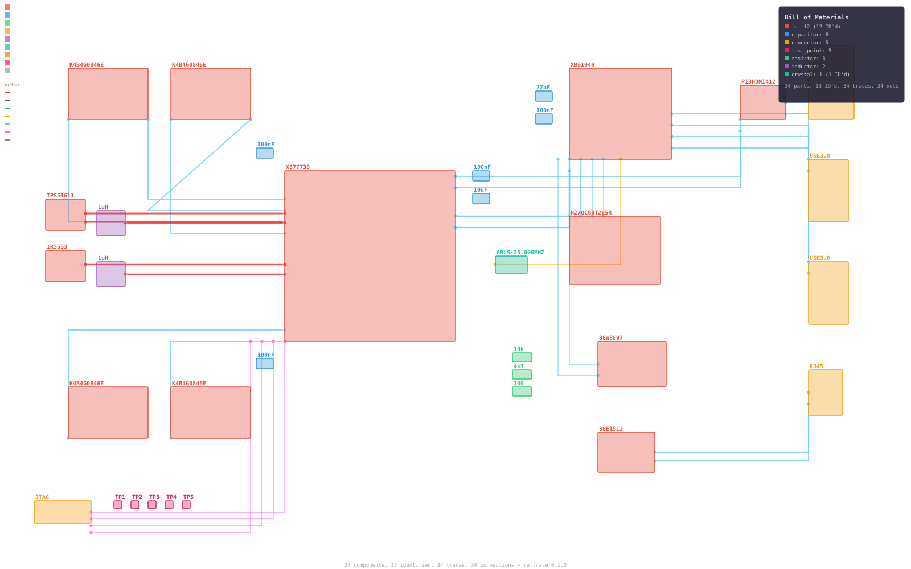
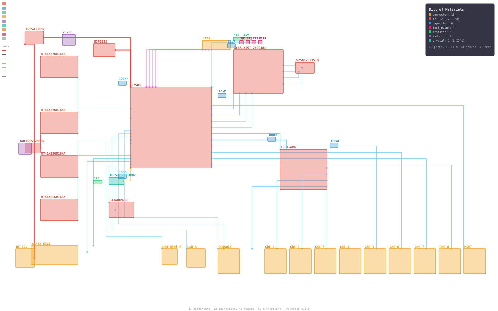
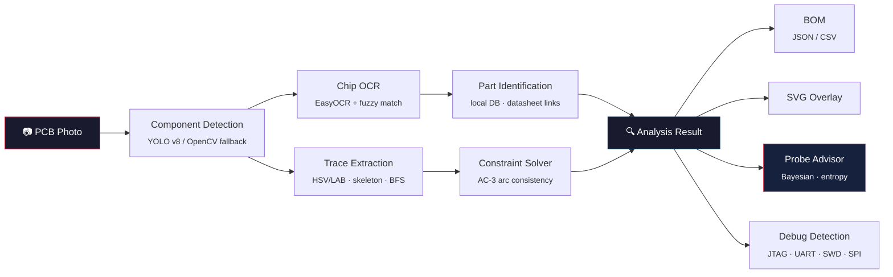

<div align="center">

# re:trace

**The first open-source photo-to-schematic PCB reverse engineering toolkit**

*Photo in, schematic out. No design files required.*

[](https://github.com/ericrihm/retrace/actions)
[](https://pypi.org/project/retrace-pcb/)
[](LICENSE)
[](https://github.com/ericrihm/retrace)

**<!-- STATS:tests -->490<!-- /STATS --> tests** · **<!-- STATS:modules -->20<!-- /STATS --> modules** · **<!-- STATS:loc -->5869<!-- /STATS --> LOC** · **Zero required ML deps**

[Quick Start](#quick-start) · [How It Works](#how-it-works) · [For Security Researchers](#for-security-researchers) · [API Examples](#api-examples)

</div>

---

Feed it a PCB photo. Get back identified components, traced connections, a bill of materials, and optimal probe points. No microscope. No schematic. No prior knowledge of the board required.

```bash
pip install retrace-pcb
retrace scan board_photo.jpg
```

### Demo: Dual-Board Analysis

Two boards. Two worlds. Both analyzed from photos alone.

<table>
<tr>
<td width="50%">

**Xbox One — Gaming Hardware RE**



AMD Jaguar APU, 8GB DDR3, Southbridge — 34 components detected, 34 traces classified (power, signal, debug, clock)

</td>
<td width="50%">

**Cisco ASA 5506-X — Enterprise Firewall RE**



Intel Atom C2508, Xilinx Spartan-6 Trust Anchor FPGA, 4x DDR3 ECC — 43 components, 41 traces, full attack surface mapped

</td>
</tr>
</table>

> The Cisco ASA 5506-X is the target of **Thrangrycat (CVE-2019-1649)** — a FPGA bitstream manipulation attack that undermines Cisco's hardware root of trust — and the **ArcaneDoor** state-sponsored APT campaign (2024). CISA Emergency Directive ED 25-03 mandated immediate patching. re:trace maps the complete attack path: JTAG header → Intel Atom C2508 → Xilinx Spartan-6 FPGA ← unencrypted SPI flash (W25Q128JV).

<details>
<summary><b>Cisco ASA 5506-X — Debug Interface Detection</b></summary>

```
Total findings: 2  (HIGH=1  MEDIUM=1)

  [HIGH]  JTAG
         Component : J15  (connector)
         Marking   : JTAG
         Detail    : JTAG debug interface — full CPU debug/program access
         Reference : CWE-1191

  [MEDIUM]  UART
         Component : J10  (connector)
         Marking   : CONSOLE
         Detail    : UART/serial console — may expose bootloader or root shell
         Reference : CWE-1299
```

</details>

<details>
<summary><b>Cisco ASA 5506-X — Constraint Solver</b> — 269 nodes, 88 AC-3 iterations</summary>

```
AC-3 iterations: 88  |  269 nodes  |  3 inferred connections

  [POWER]   U1.VCC, U2-U5.VDD/VDDQ, U6.VCC, U10-U12.VIN, J14.VCC_12V
  [GROUND]  U1.GND, J1-J9.GND, J10-J15.GND, U10-U12.GND (36 nodes)

  Inferred: U1.VCC  ↔  U11.SW         (VRM output to CPU core rail)
  Inferred: U6.TRUST_VERIFY ↔ U11.SW  (FPGA Trust Anchor verification via power rail)
```

</details>

<details>
<summary><b>Cisco ASA 5506-X — Probe Advisor</b> — Bayesian information-gain ranking</summary>

```
Top 5 Probe Recommendations (269 nodes, Dirichlet belief):

  #1  U1.DDR3_DQ0   EIG: 4.807 bits    most likely net: VCC_CORE (3.6%)
  #2  U1.DDR3_A0    EIG: 4.807 bits    most likely net: VCC_CORE (3.6%)
  #3  U1.PCIE_TX0   EIG: 4.807 bits    most likely net: VCC_CORE (3.6%)
  #4  U1.PCIE_RX0   EIG: 4.807 bits    most likely net: VCC_CORE (3.6%)
  #5  U1.SATA_TX    EIG: 4.807 bits    most likely net: VCC_CORE (3.6%)
```

</details>

<details>
<summary><b>Xbox One — Debug Interface Detection</b></summary>

```
Total findings: 3  (HIGH=2  MEDIUM=1)

  [HIGH]  JTAG on J5 (connector, marking: JTAG)
          Full CPU debug access on AMD APU — CWE-1191

  [HIGH]  SPI on U7 (ic, marking: H27QCG8T2E5R)
          64GB eMMC flash — firmware extraction risk — CWE-1191

  [MEDIUM] USB on J2/J3 (connector, marking: USB3.0)
           USB debug mode possible via DFU — CWE-1244
```

</details>

> **Novel contributions** — re:trace is the first public tool to combine **(1)** Bayesian probe-point optimization using Shannon entropy for hardware RE, **(2)** AC-3 arc-consistency constraint propagation to infer missing PCB connections from partial traces, **(3)** cross-board pattern recognition that transfers subcircuit knowledge between boards, and **(4)** automated trust chain mapping (FPGA → SPI flash → CPU) for hardware root-of-trust analysis. The Cisco ASA demo maps the exact Thrangrycat attack path. See [Prior Work](#prior-work) for the full competitive landscape.

## How It Works



**Pipeline stages:**
1. **Detect** — YOLO v8 finds components (ICs, caps, resistors, connectors, headers, test points). Falls back to OpenCV contours when YOLO isn't installed — zero model downloads needed.
2. **OCR** — EasyOCR reads chip markings from IC bounding boxes. Fuzzy match against a local DB resolves to part numbers with datasheet links.
3. **Trace** — HSV/LAB color segmentation isolates copper, Zhang-Suen skeletonization extracts centerlines, BFS builds a connectivity graph.
4. **Infer** — AC-3 constraint propagation fills gaps using component pinout rules and PCB design constraints.
5. **Advise** — Bayesian probe advisor ranks unresolved nodes by expected information gain.
6. **Export** — BOM (JSON/CSV), annotated SVG overlay, debug interface report.

## Prior Work

Every existing tool either requires design files, only handles one stage, or needs manual annotation:

| Capability | [pcbre](https://github.com/pcbre/pcbre) | [OpenBoardView](https://github.com/OpenBoardView/OpenBoardView) | KiCad | [tracespace](https://github.com/tracespace/tracespace) | [JTAGulator](https://github.com/grandideastudio/jtagulator) | **re:trace** |
|---|:---:|:---:|:---:|:---:|:---:|:---:|
| **Input** | Photo | `.brd` files | Schematic | Gerber | Physical pins | **Photo** |
| Auto-detect components | Manual | - | - | - | - | **YOLO v8** |
| OCR markings → datasheet | - | - | - | - | - | **EasyOCR** |
| Trace extraction | Manual | - | - | Render only | - | **Automated** |
| Infer missing connections | - | - | - | - | - | **AC-3** |
| Optimal probe selection | - | - | - | - | Brute-force | **Bayesian** |
| Cross-board learning | - | - | - | - | - | **Flywheel** |
| BOM from photo | - | - | Schematic only | - | - | **Yes** |
| FCC image search | - | - | - | - | - | **Built-in** |
| Debug interface detection | - | - | - | - | Pin scan | **Pattern match** |
| Plugin system | - | - | Yes | - | - | **Entry-point** |
| Zero ML deps option | N/A | N/A | N/A | N/A | N/A | **Yes** |

The closest academic precedent is [Kleber et al. (USENIX WOOT 2017)](https://www.usenix.org/system/files/conference/woot17/woot17-paper-kleber.pdf) — automated PCB RE from photos — which is now 8 years old with no public follow-on tool. Recent YOLO PCB papers ([EC-YOLO 2024](https://www.mdpi.com/1424-8220/24/13/4363), [FPIC-Component 2023](https://www.mdpi.com/2079-9292/12/11/2450)) target manufacturing defect detection, not reverse engineering. re:trace is the first public implementation combining detection, OCR, trace mapping, constraint inference, and probe optimization in a single pipeline.

## Quick Start

```bash
# Install — works immediately, no model downloads
pip install retrace-pcb

# Full analysis: detect + OCR + trace + identify + advise
retrace scan board_photo.jpg

# Generate bill of materials
retrace scan board_photo.jpg --bom

# Search FCC filings + iFixit teardowns
retrace search "xbox one"

# Extract copper traces as annotated SVG
retrace trace board_photo.jpg --output traces.svg

# Bayesian probe advisor — where to measure next
retrace advise board_photo.jpg

# Web UI (install gradio first)
pip install retrace-pcb[web]
retrace ui
```

### Optional ML dependencies

```bash
pip install retrace-pcb[detection]   # YOLO v8 + ONNX Runtime
pip install retrace-pcb[ocr]         # EasyOCR
pip install retrace-pcb[web]         # Gradio web UI
pip install retrace-pcb[all]         # Everything
```

## Deep Dive

### Bayesian Probe Advisor

*No equivalent exists in any other public PCB RE tool — open-source or commercial.*

Given partial board knowledge, the advisor recommends where to place your multimeter probes for **maximum information gain**:

1. Maintains a **Dirichlet belief distribution** per unresolved node over net-label hypotheses (VCC, GND, SDA, SCL, TX, RX, etc.)
2. Pin-name priors give 10x weight to likely labels (a pin near "VCC" silk gets a power prior)
3. Ranks all unresolved nodes by **expected Shannon entropy reduction**
4. After each measurement, collapses belief at the probed node and propagates through **union-find groups**
5. Voltage/resistance/continuity readings are automatically classified to net labels

Converges on unknown pin functions in **6–10 measurements** on typical boards.

### Constraint Solver (AC-3)

When trace extraction is partial (it always is on real boards), the solver infers missing connections:

- **Pinout rules** — MCU VDD must connect to power, GND to ground plane
- **Proximity rules** — 2-pin cap near IC power pin → decoupling → pins are POWER + GND
- **Differential pair detection** — IN+/IN- pairs get "different" arc constraints
- **Union-find equality** — traces with confidence ≥ 0.5 merge their connected nodes
- **AC-3 propagation** — iteratively prunes impossible values until the domain is stable

### Cross-Board Pattern Recognition

The knowledge flywheel — each board analyzed teaches subcircuit patterns that transfer to future boards:

| Pattern | Components | Identifies |
|---|---|---|
| `ldo_supply` | IC + 2 capacitors | Linear voltage regulator |
| `rc_lowpass` | Resistor + capacitor | RC low-pass filter |
| `decoupling_pair` | 2 capacitors near IC | Bulk + bypass decoupling |
| `pull_up_resistor` | Resistor near IC | I2C/SPI pull-up |
| `crystal_oscillator` | Crystal + 2 capacitors | Clock oscillator circuit |

<!-- STATS:patterns -->15<!-- /STATS --> built-in patterns. Extensible via plugins.

### Component Detection

[YOLO v8](https://docs.ultralytics.com/) fine-tuned on the [FPIC-Component dataset](https://www.mdpi.com/2079-9292/12/11/2450) — 6,260 images, 29,639 labeled objects, 25 component classes. Detects ICs, capacitors, resistors, connectors, inductors, crystals, test points, debug headers, diodes, and transistors.

Falls back to OpenCV contour detection (adaptive threshold → morphological filtering → contour hierarchy) when YOLO isn't installed. **The entire pipeline works with `pip install retrace-pcb` — zero GPU, zero model downloads.**

### Copper Trace Extraction

1. **Dual-space color segmentation** — HSV + LAB filtering isolates copper, robust across green/blue/red/black soldermask
2. **Morphological cleanup** — open/close removes noise, bridges small gaps
3. **Skeletonization** — Zhang-Suen thinning extracts trace centerlines
4. **BFS graph construction** — 8-connected traversal maps pad-to-pad connectivity
5. **Width estimation** — distance transform measures trace width at each point

### FCC Filing Pipeline

The FCC won't let any device be sold without filing internal board photos — and those photos are **public domain** under [47 CFR § 0.457](https://www.law.cornell.edu/cfr/text/47/0.457):

```bash
retrace search "cisco asa"
#
#   Cisco ASA (Cisco)
#   ──────────────────────────────────────────────────
#     1. ASA 5505 Base  (2006)               FCC: N/A-wired
#     2. ASA 5506-X  (2015)                  FCC: N/A-wired   [Thrangrycat, ArcaneDoor]
#     3. ASA 5506W-X  (2015)                 FCC: LDKASA-AP702
#     4. ASA 5508-X  (2015)                  FCC: N/A-wired
#     5. ASA 5515-X  (2012)                  FCC: N/A-wired
#     ...
#
retrace search "xbox one"
#
#   Xbox One (Microsoft)
#   ──────────────────────────────────────────────────
#     1. Xbox One (Original)  (2013)      FCC: C3K1520   iFixit #19718  [Durango]
#     2. Xbox One S  (2016)               FCC: C3K1681   iFixit #65572
#     3. Xbox One S All-Digital  (2019)   FCC: C3K1832
#     4. Xbox One X  (2017)               FCC: C3K1698   iFixit #99609  [Scorpio]
```

Also searches [iFixit](https://www.ifixit.com/) teardowns via API v2.0 for high-resolution step-by-step board photos.

**Built-in device registry** covers 10 product families and 50+ hardware revisions — Xbox One (7), Xbox Series (3), PlayStation 5 (9), Nintendo Switch (4), Steam Deck (2), Raspberry Pi (5), Ubiquiti UniFi (4), Ring Doorbell (3), **Cisco ASA** (8: 5505, 5506-X, 5506W-X, 5508-X, 5510, 5515-X, 5516-X), and **Cisco Catalyst** (3: 2960-X, 3560-X) — with FCC IDs, SoC specs, RAM, storage, security notes (Thrangrycat, AVR54, ArcaneDoor), and iFixit guide IDs. Search by product name, codename, model number, or FCC ID.

### Debug Interface Detection

Automatically flags security-relevant interfaces:

| Interface | Detection Method | Severity |
|---|---|---|
| **JTAG** | Header pattern + TDI/TDO/TCK/TMS marking | High |
| **SWD** | SWDIO/SWCLK near MCU | High |
| **UART** | TX/RX marking + 3–4 pin header | Medium |
| **SPI** | MOSI/MISO/SCK/CS near flash/EEPROM | Medium |
| **I2C** | SDA/SCL marking + pull-up resistors | Low |

Each finding includes the interface type, matched component, and CWE reference.

## API Examples

```python
from retrace.core.pipeline import Pipeline

# Full pipeline: photo → analysis result
pipeline = Pipeline()
result = pipeline.run("board_photo.jpg")

print(f"Found {len(result.components)} components, {len(result.traces)} traces")
for c in result.components:
    print(f"  {c.label}: {c.marking or 'unknown'} ({c.confidence:.0%})")
```

```python
from retrace.analysis.probe_advisor import ProbeAdvisor, Measurement

advisor = ProbeAdvisor()
advisor.add_components(result.components)

# Top 5 probe recommendations ranked by information gain
for rec in advisor.recommend(top_k=5):
    print(f"Probe {rec.node_id}: expected gain = {rec.score:.3f} bits")

# Feed back a measurement — beliefs update + propagate
advisor.update(Measurement(node_id="J1:3", kind="voltage", value=3.3))
```

```python
from retrace.analysis.constraint_solver import ConstraintSolver

solver = ConstraintSolver()
result = solver.solve(components, traces)
print(f"Resolved {len(result.assignments)} pins, inferred {len(result.inferred_traces)} traces")
```

```python
from retrace.sources.fcc import search_fcc, download_fcc_photos

# Search + download FCC internal photos for any product
results = search_fcc("xbox one")
photos = download_fcc_photos(results[0]["fcc_id"], dest_dir="./fcc_photos")
```

## For Security Researchers

re:trace is built for hardware security assessments:

- **Pre-engagement recon** — Search any product's FCC filing for internal board photos before you open the case
- **Attack surface mapping** — Identify MCUs, flash/EEPROM, FPGAs, crypto chips, and communication buses automatically
- **Trust anchor analysis** — Map FPGA ↔ SPI flash ↔ CPU trust chains (see Cisco ASA 5506-X Thrangrycat demo)
- **Debug interface detection** — Flag JTAG, SWD, UART, SPI headers with severity ratings and CWE references
- **Optimal probing** — Bayesian advisor tells you exactly where to measure to identify unknown pins fastest (6–10 probes to convergence)
- **Constraint inference** — When you can only trace 60% of connections, AC-3 propagation fills in the rest
- **Enterprise device registry** — Cisco ASA/Catalyst families with CVE notes, SoC details, security advisories
- **Knowledge transfer** — Patterns learned from previous boards accelerate analysis of new ones

## Plugin System

```python
from retrace.plugins.base import AnalyzerPlugin

class MyAnalyzer(AnalyzerPlugin):
    name = "my-analyzer"

    def analyze(self, components, traces):
        return {"findings": [...]}
```

```toml
# pyproject.toml — register via entry points
[project.entry-points."retrace.analyzers"]
my_analyzer = "my_package:MyAnalyzer"
```

## Architecture

```
src/retrace/                             # <!-- STATS:loc -->5869<!-- /STATS --> lines across <!-- STATS:modules -->20<!-- /STATS --> modules
├── cli.py                               # Click CLI: scan, search, trace, advise, ui, report
├── web.py                               # Gradio web interface
├── core/
│   ├── pipeline.py                      # Orchestrator: photo → AnalysisResult
│   └── config.py                        # TOML config, model paths, cache dirs
├── detection/
│   ├── detector.py                      # YOLO v8 + OpenCV contour fallback
│   ├── trace_extractor.py               # HSV/LAB → skeleton → BFS connectivity
│   └── ocr.py                           # EasyOCR chip marking extraction
├── identification/
│   └── matcher.py                       # Fuzzy part number → datasheet lookup
├── analysis/
│   ├── probe_advisor.py                 # Bayesian optimal probe selection (Shannon entropy)
│   ├── constraint_solver.py             # AC-3 arc-consistency propagation
│   └── cross_board.py                   # Cross-board subcircuit pattern matching
├── sources/
│   ├── fcc.py                           # FCC filing scraper (47 CFR § 0.457, public domain)
│   ├── ifixit.py                        # iFixit API v2.0 client (CC BY-NC-SA)
│   ├── device_registry.py               # 50+ revisions across 10 product families (Xbox, PS5, Cisco ASA, etc.)
│   └── board_sourcer.py                 # Unified multi-source image acquisition
├── learning/
│   └── engine.py                        # Cross-board knowledge flywheel
├── plugins/
│   ├── base.py                          # Plugin protocol + entry-point discovery
│   └── builtin/
│       └── debug_interfaces.py          # JTAG/UART/SWD/SPI/I2C detection
└── export/
    ├── bom.py                           # BOM generator (JSON, CSV)
    └── svg.py                           # SVG overlay: components, traces, net classification, BOM panel
```

## Stats

| Metric | Value |
|--------|-------|
| Tests | <!-- STATS:tests -->490<!-- /STATS --> |
| Coverage | <!-- STATS:coverage -->89%<!-- /STATS --> |
| Modules | <!-- STATS:modules -->20<!-- /STATS --> |
| Lines of code | <!-- STATS:loc -->5869<!-- /STATS --> |
| Component DB | <!-- STATS:components -->114<!-- /STATS --> parts |
| Circuit patterns | <!-- STATS:patterns -->15<!-- /STATS --> built-in |

<sub>Auto-updated by <code>tools/readme_stats.py</code></sub>

## Development

```bash
git clone https://github.com/ericrihm/retrace.git
cd retrace
pip install -e ".[dev]"
pytest                         # <!-- STATS:tests -->490<!-- /STATS --> tests, <1s
ruff check src/ tests/         # lint
retrace --help                 # CLI reference
```

## Legal

- **FCC internal photos** — public domain under [47 CFR § 0.457](https://www.law.cornell.edu/cfr/text/47/0.457)
- **iFixit images** — used under [CC BY-NC-SA 3.0](https://creativecommons.org/licenses/by-nc-sa/3.0/) (Xbox One teardown photos by [iFixit](https://www.ifixit.com/Teardown/Xbox+One+Teardown/19718))
- **No firmware files** or exploit code included or referenced
- **Component datasheets** — linked via URL, never redistributed
- **Detection models** — trained exclusively on public datasets ([FPIC-Component](https://www.mdpi.com/2079-9292/12/11/2450), CC-licensed images)

## License

MIT — use it for research, pentests, product teardowns, education, whatever.

## Author

Built by [Eric Rihm](https://github.com/ericrihm) — hardware security researcher, builder of things that stare at circuit boards, back again.
